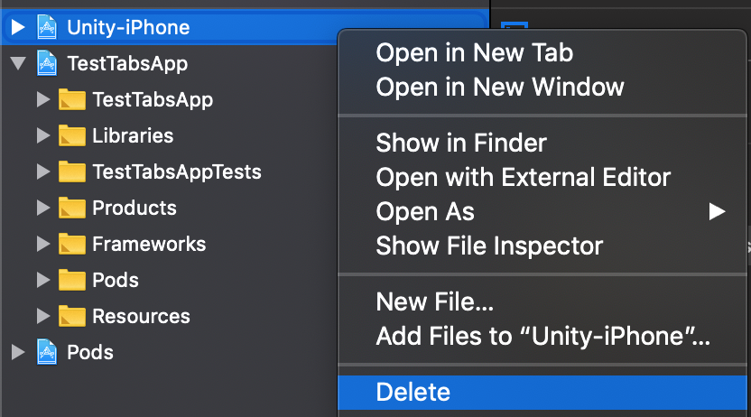
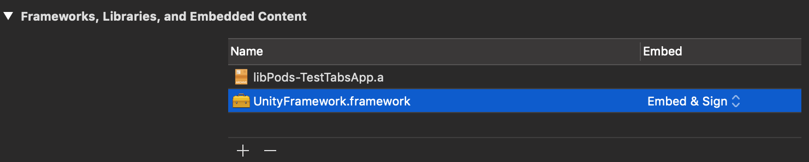
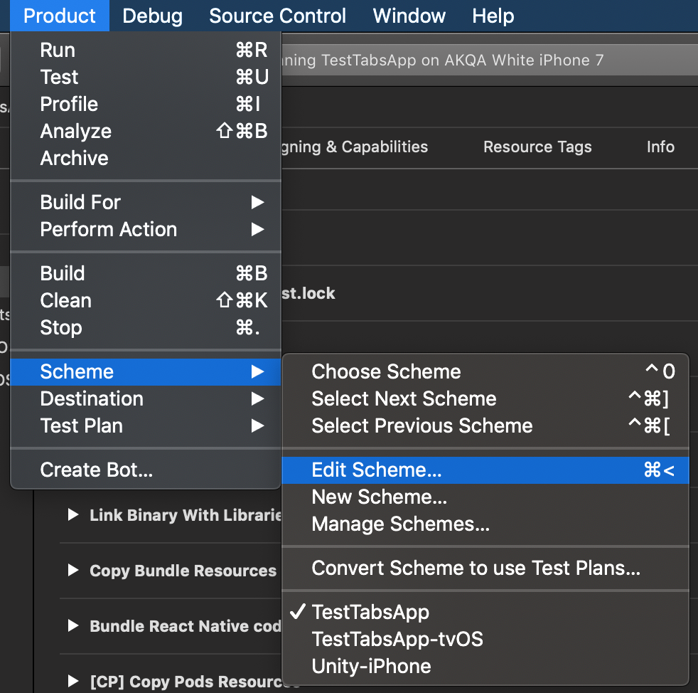
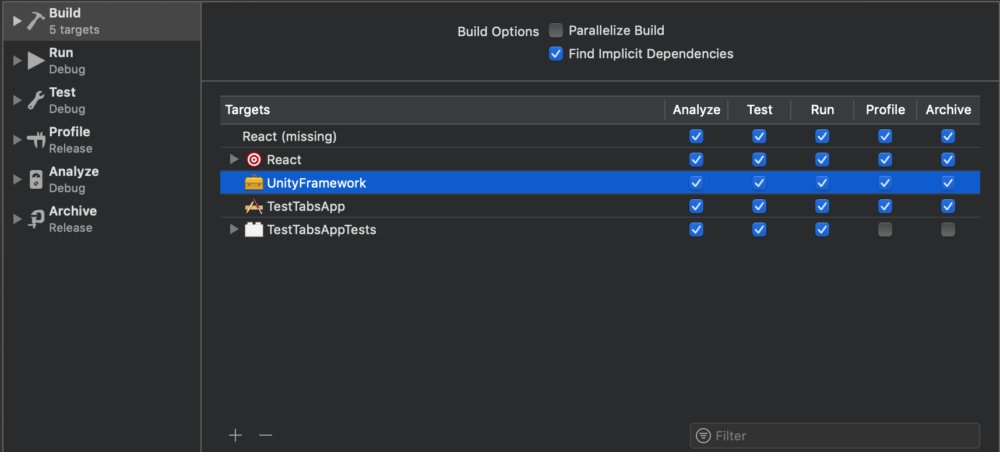
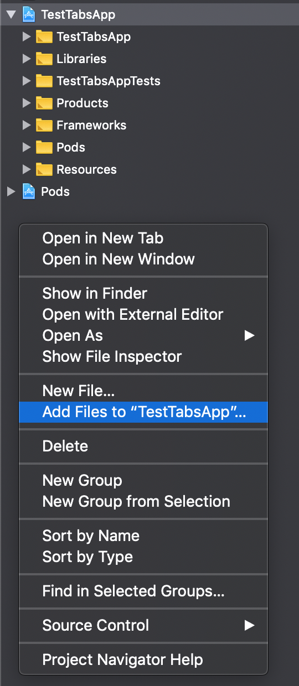
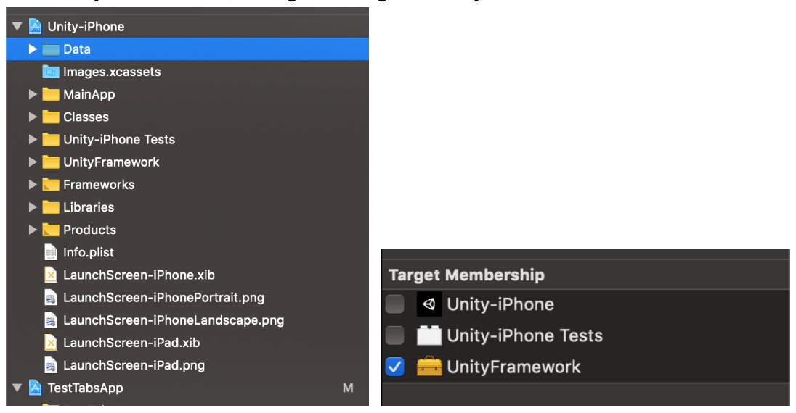
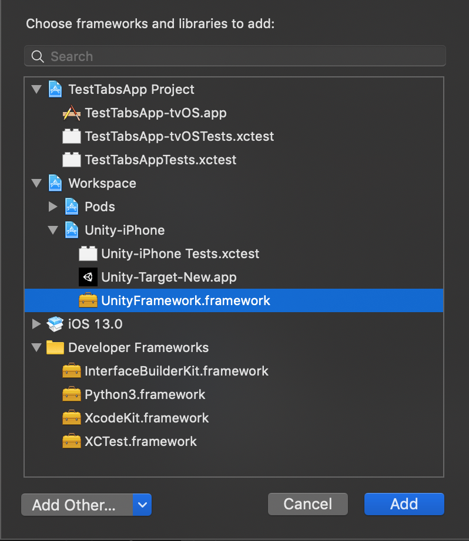
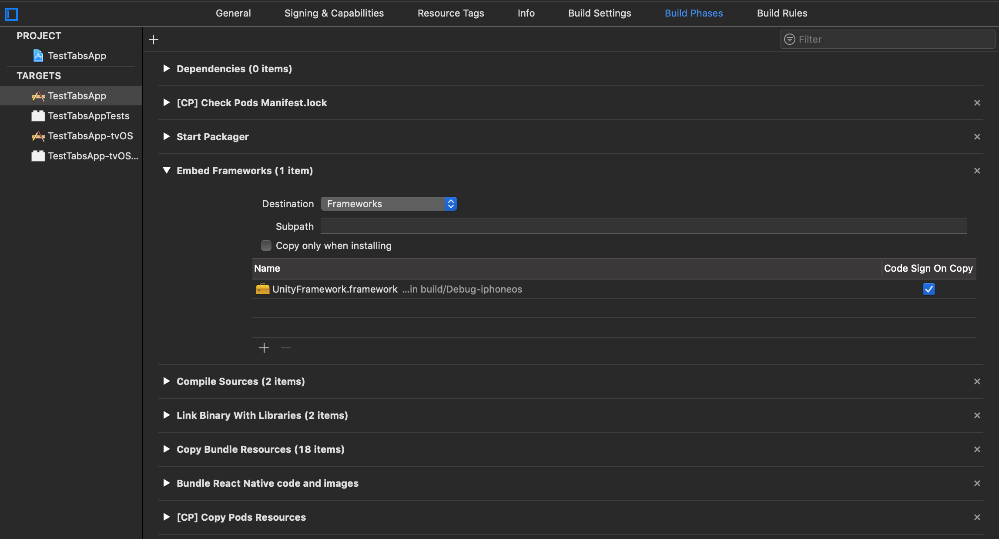
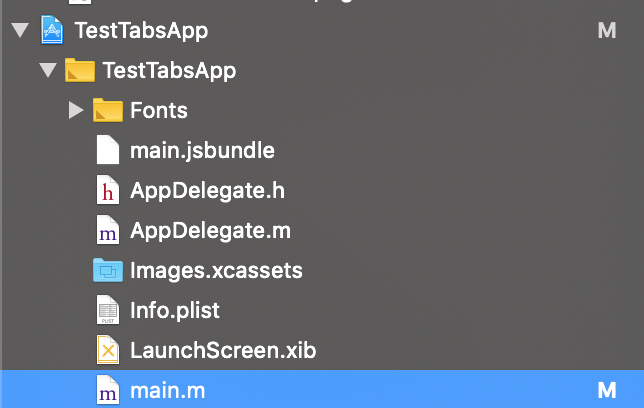
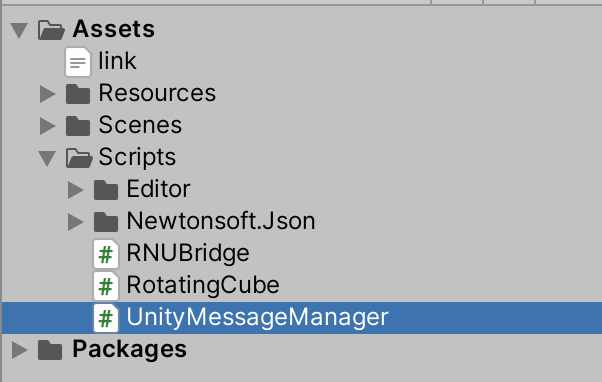

# Config for iOS


## **Cleanup:**

- Delete the **Unity-iPhone.xcodeproj** inside your Xcode workspace.

<p align="center">
    
</p>

- In the main project *(TestTabsApp in my case)* > General > Frameworks, Libraries and Embedded Content > **Delete the UnityFramework**.

<p align="center">
    
</p>

- Also in the main project > Product > **Scheme** > Edit Scheme... > Build > **Delete the UnityFramework**. 

<p align="center">
    
</p>

<p align="center">
    
</p>

- Stop the packager.


## **Reimport the UnityProject:**

- Re-export the Unity Project if needed.

- Add **ios/UnityExport/Unity-iPhone.xcodeproj** into the workspace (Right click > Add files to...).

<p align="center">
    
</p>

- In **Unity-iPhone/Data, change the Target Membership to UnityFramework**.

    <p align="center">
    
</p>

- In the main project > General > Frameworks, Libraries and Embedded Content > **Add the UnityFramework**.

<p align="center">
    
</p>

<p align="center">
    
</p>

- In the main project > Product > **Scheme **> Edit Scheme... > Build > **Add UnityFramework and move it above everything else**.

<p align="center">
    
</p>

- *(Optional)* In the main project > **Build Phases** > Move **Embed Frameworks** like so:

<p align="center">
    
</p>
    

## **Additional config codes:** 

- In the main project, make sure that this is the code inside **main.m**:

<p align="center">
    
</p>

```
#import <UIKit/UIKit.h>

#import "AppDelegate.h"

#import "UnityUtils.h"

int main(int argc, char * argv[]) {
    @autoreleasepool {
        InitArgs(argc, argv);
        return UIApplicationMain(argc, argv, nil, NSStringFromClass([AppDelegate class]));
    }
}
```

- In the Unity Project, for the **UnityMessageManager.cs** (add **UnityMessageManager.**, but if you import this script from my .unitypackage from above, just skip), else, edit like so and re-export the Unity Project:

<p align="center">
    
</p>

```
#if UNITY_IOS && !UNITY_EDITOR
    UnityMessageManager.onUnityMessage(message);
#endif
```

## **Rerun**:

- Clean the build.

- Restart packager.

- Rebuild.