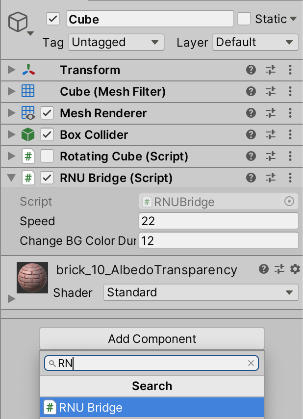
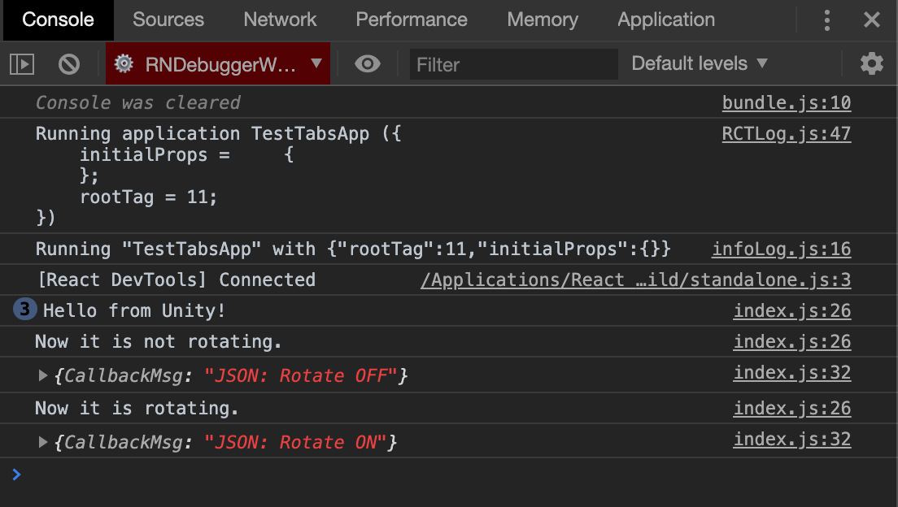

# basic-react-native-unity

Basic React Native app with Tabs navigation and Integration of Unity View.

Works on both Android and iOS.

**Kudos to [@asmadsen/react-native-unity-view](https://github.com/asmadsen/react-native-unity-view).**


## Demo

<p align="center">
  
</p>


## Getting Started

These instructions will get you a copy of the project up and running on your local machine for development and testing purposes. 


### Prerequisites

- node / npm / yarn.
- **React Native 0.6+**.
- **Unity 2019.3+**.
- **Xcode** *(mine is 11)*.
- **Real test devices** *(for both platforms, especially for iOS, since the simulator won't work, you'll also need to have an Apple ID to be able to sign the app). Mine are Samsung S8 & iPhone starting from 7*.
- React Native Debugger *(optional, if you want to test bridge messages that's it)*.


### Installing

- Clone this repo && cd.

- Install dependencies & packages:

```
$ npm i

// OR

$ yarn
```

- Here's already premade builds for up and running. Download it and unzip it.

    - [**UnityExport for iOS**](https://www.dropbox.com/s/fkuncvje5w4bqpm/UnityExport-ios.zip?dl=0).
    - [**UnityExport for Android**](https://www.dropbox.com/s/5h0nef78fox0igt/UnityExport-android.zip?dl=0).


- Move the UnityExport folder for each platform into ios/ or android/.

<p align="center">
  
</p>

<p align="center">
  
</p>


- Link:

```
$ react-native link
$ react-native link @asmadsen/react-native-unity-view
```


## Running the tests

- Plug your device and make sure your system recognize it.

- Start the packager *(skip for Android if you want)*:

```
$ react-native start
```


### For Android:

Gradle files are already configured. You just need to run:

```
$ react-native run-android
```


### For iOS

- Install pods:
```
$ cd ios
$ cd pod install
$ cd ..
```

- *(Optional)* Relink *(just in case, just to make sure)*:
```
$ react-native link
$ react-native link @asmadsen/react-native-unity-view 
```

- Open the **.xcworkspace** in Xcode.


- Check and fix signing conflicts for both the Main Project and the Unity-iPhone Project (for Tests Target too).

<p align="center">
  
  
  
</p>

- Clean and Build the Main project for a real device, while the packager is running.


- If the build succeeded but the app is not installed and launched on the device, just restart the packager, maybe delete the app on the iPhone, then clean and rebuild project. And make sure that your Apple ID works.

```
$ react-native start
```


## How to use your own Unity Project

- Want your own Unity Scene ?

<p align="center">
  
</p>

- Basically, you can just follow [**the guide from asmadsen**](https://github.com/asmadsen/react-native-unity-view). Or keep reading.


### Create a new Unity Project

- Inside the unity/ folder, create your own Unity Project. So it will look like this:

<p align="center">
  
</p>

<p align="center">
    <i>(The folder's name doesn't matter.)</i>
</p>
    
- [Here's a starter basic Unity Project](https://github.com/sdsmnc221/basic-unity), go ahead and clone it if you want:

```
$ cd unity
$ git clone https://github.com/sdsmnc221/basic-unity.git UnityProject
$ cd ..
```

- Open the project in **Unity 2019.3+**. 


### Import react-native-unity-view into the Unity Project

- Download my [**react-native-unity-view-bridge package**](/resources/react-native-unity-view-bridge.unitypackage) (which already includes all of the scripts from [asmadsen](https://github.com/asmadsen/react-native-unity-view) and [f111fei](https://github.com/f111fei/react-native-unity-view)).

- On the Project Panel, Assets > Import Package > Custom Package... > Import the package:

<p align="center">
  
  
</p>

- You will now have a ReactNative Menu!

<p align="center">
  
</p>

<p align="center">
    <i>(From this...)</i>
</p>

<p align="center">
  
</p>

<p align="center">
    <i>(...to this.)</i>
</p>


### Configure the Unity Project

- Open the Player Settings (Shift Cmd B > Player Settings).

- Change Product Name to the name of the React Native Xcode project **(ios/${XcodeProjectName}.xcodeproj)**:

<p align="center">
  
  
</p>

- Android configs:

<p align="center">
  
</p>

<p align="center">
    <i>(Auto Graphics API unchecked.)</i>
</p>

<p align="center">
  
</p>

<p align="center">
    <i>(Android SDK version.)</i>
</p>

<p align="center">
  
</p>

<p align="center">
    <i>(Other configs: IL2CPP, .NET 4.x, ARM64 checked.)</i>
</p>

- iOS configs:

<p align="center">
  
</p>

<p align="center">
    <i>(Auto Graphics API checked.)</i>
</p>

<p align="center">
  
</p>

<p align="center">
    <i>(Identification configs (correctly config your signing team ID and Automatically Sign checked.)</i>
</p>


### Export the Unity Project

- You can now export your project via the menu (not the Build Settings):

<p align="center">
  
</p>

<p align="center">
    <i>(<b>Export Android (Unity...)</b> or <b>Export iOS (Unity...)</b> .)</i>
</p>

- The exported builds will be placed in a folder called UnityExport inside either the android/ or ios/ folder.

<p align="center">
  
</p>

<p align="center">
  
</p>

- Wait until Build Successful.

<p align="center">
  
</p>

- **ATTENTION: Every time changes are made inside the Unity Project, no matter which change is it, please re-export the project.**

- **Loading more than one instance of the Unity runtime is not supported.** This is a crucial limitation, as mentioned in [here, from the Unity Blog](https://forum.unity.com/threads/using-unity-as-a-library-in-native-ios-android-apps.685195/), and also with the react-native-unity-view package, there are only one UnityExport. I still don’t know whether we can run multiple Unity scenes or views inside a single React Native App. For scenes, perhaps, I speculate creating a SceneManager inside the Unity Project (will test it later). But for views (as in multiple instances of Unity), maybe it is not yet possible.


### Config and Run on Android

- Export the Unity Project.

- Normally all of the Gradle files in this repo are preconfigured.

    - If you're interested in the configs, please refer to [asmadsen's docs](https://github.com/asmadsen/react-native-unity-view).

    - OR just go look at [**android/settings.gradle**](android/settings.gradle), [**android/build.gradle**](android/build.gradle), [**android/app/build.gradle**](android/app/build.gradle) where there are the comment *// unity*.

- *(Optional)* Make sure that **the minSdkVersion for everywhere inside this whole React Native project is at least 19**. *(You can run a search of 'minSdkVersion' inside VS Code to check. Sometimes it isn't always 19 everywhere, sometimes. But not in this repo...)*

- Plug in your Android device and run:

```
$ react-native run-android
```

### Config and Run on iOS

- Export the Unity Project.

- Open the **.xcworkspace** in Xcode.


- Check and fix signing conflicts for both the Main Project and the Unity-iPhone Project (for Tests Target too), if needed.

<p align="center">
  
  
  
</p>

- Clean and Build the Main project for a real device, while the packager is running.


- If the build succeeded but the app is not installed and launched on the device, just restart the packager, clean and rebuild project. And make sure that your Apple ID works.

```
$ react-native start
```

- The Xcode project is also preconfigured so you don't need to to anything.

    - If you're interested in the configs, please refer to [asmadsen's docs](https://github.com/asmadsen/react-native-unity-view).

    - OR here, in case build failed, or you need illustrated guide: [README-ios.md](README-ios.md).

- IF Build succeeded, but the app isn't installed nor launched on the device:

    - *(Optional)* Unplug and replug the iPhone.

    - *(Optional)* Close and reopen Xcode workspace.

    - Delete the app on the device.

    - Clean the build.

    - Restart the packager.

    - Rebuild.

*Really this can happen frequently if you re-export your Project... And I promise this has got to be something with the Xcode build and packager. If this isn't working just repeat. The 3 last steps can be executed in any orders, until it works haha.*


## Example usage of the API and the React Native <-> Unity Bridge

- Want a Bridge on any scene ?

<p align="center">
  
</p>

- For the full API, please refer to [asmadsen's docs](https://github.com/asmadsen/react-native-unity-view).

- In my case, I based on his docs to create an example of bridge, with:

    - On Unity side, a C# script: [RNUBridge Component](resources/RNUBridge.cs).
        - In your Unity scene, tag the Main Camera as MainCamera.
        - Add the RNUBridge Component to any GameObject.

        <p align="center">
            
        </p> 

    - On React Native side, a Javascript script: [UnityScreen](src/screens/UnityScreen/index.js).


### Bridge's keypoints: 

- UnityMessageManager in Unity:

<p align="center">
    
</p>

- UnityModule in React Native:

```
// src/screens/UnityScreen/index.js
// UnityView is the React Native Component to display the Unity scene

import UnityView, { UnityModule } from '@asmadsen/react-native-unity-view';
```

### Boot up the UnityMessageManager in Unity:

```
// RNUBridge.cs

void Awake()
{
    UnityMessageManager.Instance.OnRNMessage += onMessage;
}

void OnDestroy()
{
    UnityMessageManager.Instance.OnRNMessage -= onMessage;
}

void onMessage(MessageHandler message)
{
    var data = message.getData<string>();

    // do what you want here.
}
```

### Unity: Implement commands listener, and then execute received commands with onMessage

- I implemented 3 simple commands:

    - to toggle the GameObject's rotation; 

    - to change the Main Camera's background color; 

    - and to say Hi from Unity whenever you want *(but in my case, whenever the UnityScreen is mounted, hence the command's name is 'OnStart')*:

```
// RNUBridge.cs

void onMessage(MessageHandler message)
{
    var data = message.getData<string>();
    Debug.Log("onMessage:" + data);

    switch (data)
    {
        case "ToggleRotate":
            doRotate = !doRotate;
            UnityMessageManager.Instance.SendMessageToRN("Now it is " + (doRotate ? "" : "not ") + "rotating.");
            message.send(new { CallbackMsg = "JSON" +
                ": Rotate " + (doRotate ? "ON" : "OFF") });
            break;
        case "OnStart":
            UnityMessageManager.Instance.SendMessageToRN("Hello from Unity!");
            break;
        case "ChangeBGColor":
            doChangeBGColor = true;
            break;
        default:
            break;
    }
}

// And some other code in FixedUpdate() to make rotation and color changing work.
```
    
- Unity, after receiving commands from React Native, can execute it and send a message string to React Native:

```
UnityMessageManager.Instance.SendMessageToRN("some string");
```

- Or a callback message (message sent after executing the command) in JSON format:

```
message.send(new { CallbackMsg = "JSON" });
```

### React Native: Implement commands sender and callback receiver from Unity

- First we have the bridge function, to send message and to receive callback message:

```
// src/screens/UnityScreen/index.js

const bridge = (data, cb = null) => {

    // to receive callback message  

    if (!cb) cb = (data) => {
        console.log(data);
    }

    // to send/post command (the name is not important, but the data property must match the command name implemented in the C# script)

    UnityModule.postMessageToUnityManager({
        name: data,
        data: data,
        callBack: cb
    });
}
```

- Also the onUnityMessage, to receive the message string:

```
// src/screens/UnityScreen/index.js

const onUnityMessage = (message) => {
    console.log(message);
};

// attach it to the <UnityView />

UnityView
    onMessage={onUnityMessage}
    onUnityMessage={onUnityMessage}
/>

```

- Using the bridge function:

    - When the screen is mounted or focused:

    ```
    useEffect(() => {
        bridge('OnStart');
        
        if (isFocused) bridge('OnStart');
    }, [])
    ```

    - 2 simple buttons to send commands to the Unity Scene (either toggle rotation or changing the scene’s background color):

    ```
    <TouchableOpacity onPress={() => bridge('ToggleRotate')}>
        <Text>Toggle Rotation</Text>
    </TouchableOpacity>

    <TouchableOpacity onPress={() => bridge('ChangeBGColor')}>
        <Text>Change Background Color</Text>
    </TouchableOpacity>
    ```

    - I used the state to display Unity's messages (for instance I only display the message for the Toggle Rotation command).

### Others:

- To persist the Unity screen:

```
const UnityScreen = ({navigation}) => {
  navigation.setOptions({
    unmountOnBlur: true
  });

  return (<View> </View>)
}
```

- You can see the debug log on your terminal or your React Native Debugger's console:

<p align="center">
    
</p>

- Well that's it, hope you can do more!


## Built With

- [@asmadsen/react-native-unity-view](https://github.com/asmadsen/react-native-unity-view).
- React Native.
- Unity.


## Authors

- [**sdsmnc**](https://github.com/sdsmnc221) / [**An TRUONG**](https://antr.tech) @ Gobelins.


## Acknowledgments

- [**asmadsen**](https://github.com/asmadsen).


## TODO

- [x] Upload a nice demo gif.
- [X] Upload then include downdload links for UnityExports.
- [x] Working docs for Android.
- [x] Workings docs for iOS.
- [x] Upload a fresh UnityProject.
- [x] Docs for UnityProject & how to export and build the project on your own in:
    - [x] Android.
    - [x] iOS.
- [x] Docs for Bridge.
- [ ] Support for multiple Unity scenes. **Multiple Unity Views / Instances are impossible**, until further updates from Unity and asmadsen (if he decides not to drop his project haha).

