# basic-react-native-unity

Basic React Native app with Tabs navigation and Integration of Unity View.

Works on both Android and iOS.

**Kudos to [@asmadsen/react-native-unity-view](https://github.com/asmadsen/react-native-unity-view).**


## Demo

<p align="center">
  
</p>


## Getting Started

These instructions will get you a copy of the project up and running on your local machine for development and testing purposes. 


### Prerequisites

- node / npm / yarn.
- **React Native 0.6+**.
- **Unity 2019.3+**.
- **Xcode** *(mine is 11)*.
- **Real test devices** *(for both platforms, especially for iOS, since the simulator won't work, you'll also need to have an Apple ID to be able to sign the app). Mine are Samsung S8 & iPhone starting from 7*.
- React Native Debugger *(optional, if you want to test bridge messages that's it)*.


### Installing

- Clone this repo && cd.

- Install dependencies & packages:

```
$ npm i

// OR

$ yarn
```

- Here's already premade builds for up and running. Download it and unzip it.

    - [**UnityExport for iOS**](https://www.dropbox.com/s/fkuncvje5w4bqpm/UnityExport-ios.zip?dl=0).
    - [**UnityExport for Android**](https://www.dropbox.com/s/5h0nef78fox0igt/UnityExport-android.zip?dl=0).


- Move the UnityExport folder for each platform into ios/ or android/.

<p align="center">
  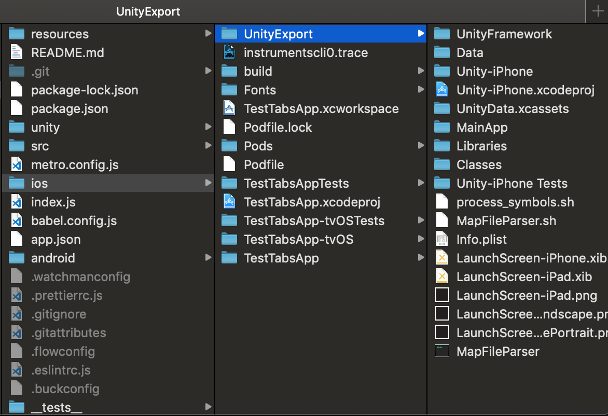
</p>

<p align="center">
  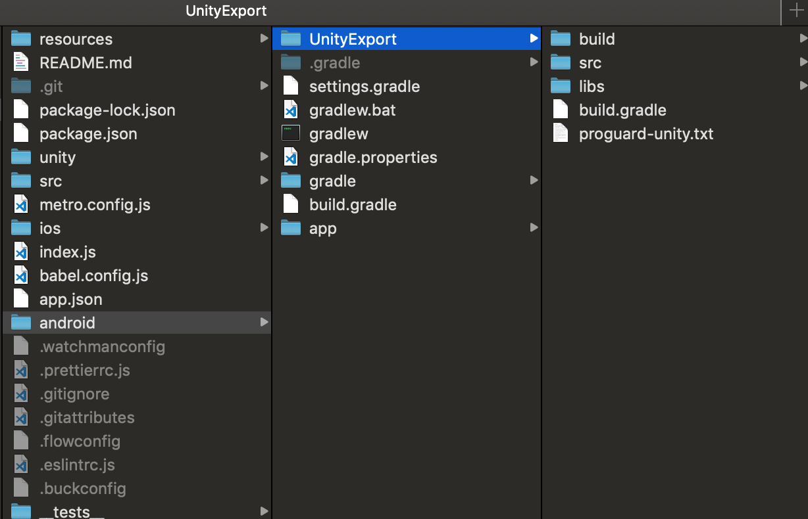
</p>


- Link:

```
$ react-native link
$ react-native link @asmadsen/react-native-unity-view
```


## Running the tests

- Plug your device and make sure your system recognize it.

- Start the packager *(skip for Android if you want)*:

```
$ react-native start
```


### For Android:

Gradle files are already configured. You just need to run:

```
$ react-native run-android
```


### For iOS

- Install pods:
```
$ cd ios
$ cd pod install
$ cd ..
```

- *(Optional)* Relink *(just in case, just to make sure)*:
```
$ react-native link
$ react-native link @asmadsen/react-native-unity-view 
```

- Open the **.xcworkspace** in Xcode.


- Check and fix signing conflicts for both the Main Project and the Unity-iPhone Project (for Tests Target too).

<p align="center">
  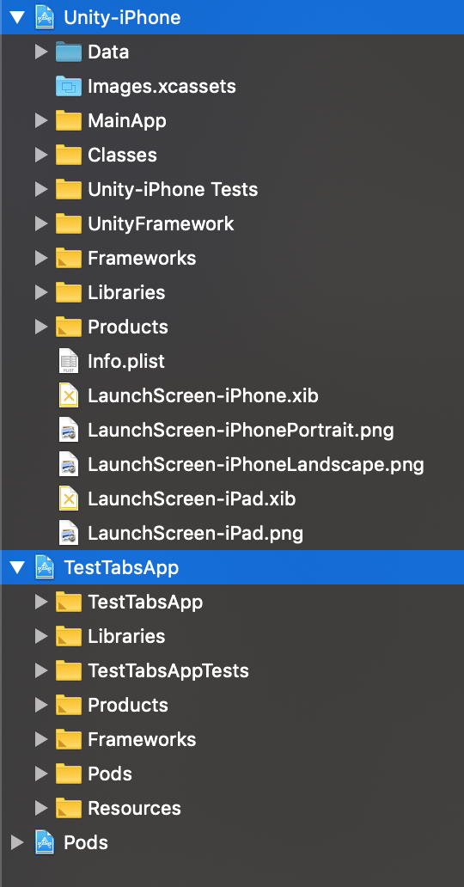
  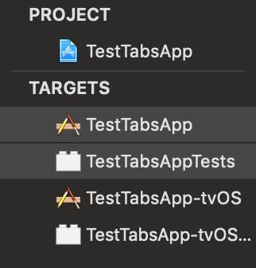
  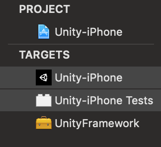
</p>

- Clean and Build the Main project for a real device, while the packager is running.


- If the build succeeded but the app is not installed and launched on the device, just restart the packager, clean and rebuild project. And make sure that your Apple ID works.

```
$ react-native start
```


## How to use your own Unity Project

- Want your own Unity Scene ?

<p align="center">
  
</p>

- Basically, you can just follow [**the guide from asmadsen**](https://github.com/asmadsen/react-native-unity-view). Or keep reading.


### Create a new Unity Project

- Inside the unity/ folder, create your own Unity Project. So it will look like this:

<p align="center">
  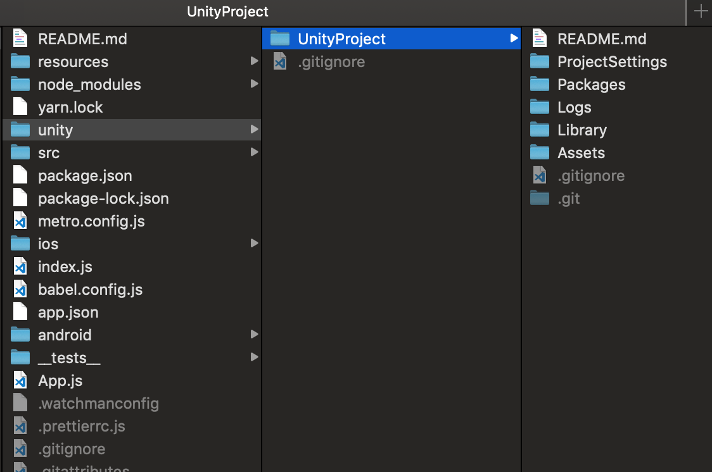
</p>

<p align="center">
    <i>(The folder's name doesn't matter.)</i>
</p>
    
- [Here's a starter basic Unity Project](https://github.com/sdsmnc221/basic-unity), go ahead and clone it if you want:

```
$ cd unity
$ git clone https://github.com/sdsmnc221/basic-unity.git UnityProject
$ cd ..
```

- Open the project in **Unity 2019.3+**. 


### Import react-native-unity-view into the Unity Project

- Download my [**react-native-unity-view-bridge package**](/resources/react-native-unity-view-bridge.unitypackage) (which already includes all of the scripts from [asmadsen](https://github.com/asmadsen/react-native-unity-view) and [f111fei](https://github.com/f111fei/react-native-unity-view)).

- On the Project Panel, Assets > Import Package > Custom Package... > Import the package:

<p align="center">
  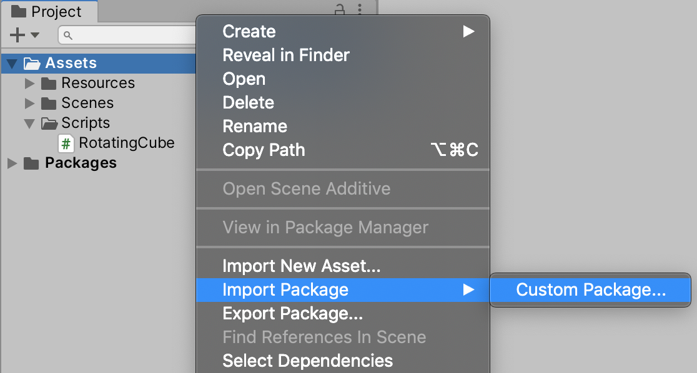
  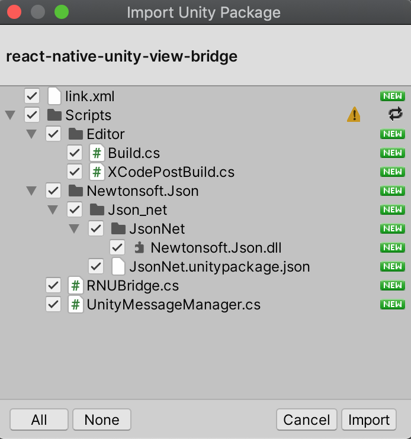
</p>

- You will now have a ReactNative Menu!

<p align="center">
  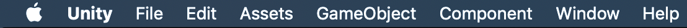
</p>

<p align="center">
    <i>(From this...)</i>
</p>

<p align="center">
  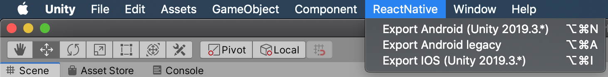
</p>

<p align="center">
    <i>(...to this.)</i>
</p>


### Configure the Unity Project

- Open the Player Settings (Shift Cmd B > Player Settings).

- Change Product Name to the name of the React Native Xcode project **(ios/${XcodeProjectName}.xcodeproj)**:

<p align="center">
  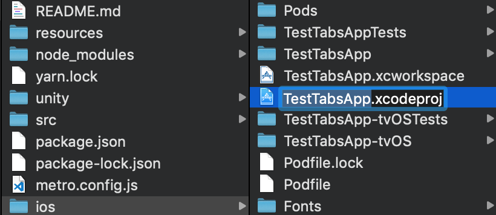
  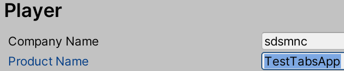
</p>

- Android configs:

<p align="center">
  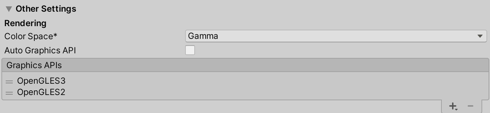
</p>

<p align="center">
    <i>(Auto Graphics API unchecked.)</i>
</p>

<p align="center">
  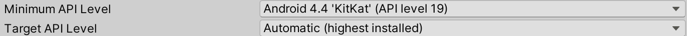
</p>

<p align="center">
    <i>(Android SDK version.)</i>
</p>

<p align="center">
  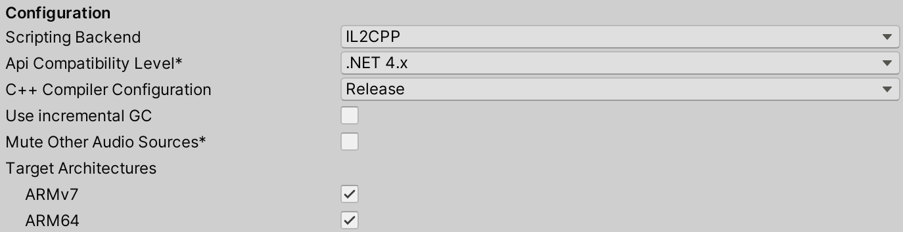
</p>

<p align="center">
    <i>(Other configs: IL2CPP, .NET 4.x, ARM64 checked.)</i>
</p>

- iOS configs:

<p align="center">
  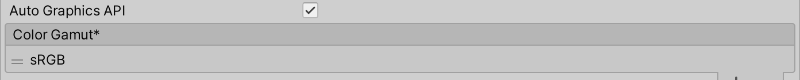
</p>

<p align="center">
    <i>(Auto Graphics API checked.)</i>
</p>

<p align="center">
  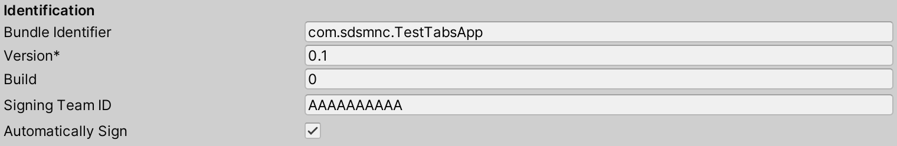
</p>

<p align="center">
    <i>(Identification configs (correctly config your signing team ID and Automatically Sign checked.)</i>
</p>


### Export the Unity Project

- You can now export your project via the menu (not the Build Settings):

<p align="center">
  
</p>

<p align="center">
    <i>(<b>Export Android (Unity...)</b> or <b>Export iOS (Unity...)</b> .)</i>
</p>

- The exported builds will be placed in a folder called UnityExport inside either the android/ or ios/ folder.

<p align="center">
  
</p>

<p align="center">
  
</p>

- Wait until Build Successful.

<p align="center">
  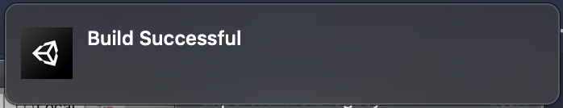
</p>

- **ATTENTION: Every time changes are made inside the Unity Project, no matter which change is it, please re-export the project.**

- **Loading more than one instance of the Unity runtime is not supported.** This is a crucial limitation, as mentioned in [here, from the Unity Blog](https://forum.unity.com/threads/using-unity-as-a-library-in-native-ios-android-apps.685195/), and also with the react-native-unity-view package, there are only one UnityExport. I still don’t know whether we can run multiple Unity scenes or views inside a single React Native App. For scenes, perhaps, I speculate creating a SceneManager inside the Unity Project (will test it later). But for views (as in multiple instances of Unity), maybe it is not yet possible.


### Config and Run on Android

- Export the Unity Project.

- Normally all of the Gradle files in this repo are preconfigured.

    - If you're interested in the configs, please refer to [asmadsen's docs](https://github.com/asmadsen/react-native-unity-view).

    - OR just go look at [**android/settings.gradle**](android/settings.gradle), [**android/build.gradle**](android/build.gradle), [**android/app/build.gradle**](android/app/build.gradle) where there are the comment *// unity*.

- *(Optional)* Make sure that **the minSdkVersion for everywhere inside this whole React Native project is at least 19**. *(You can run a search of 'minSdkVersion' inside VS Code to check. Sometimes it isn't always 19 everywhere, sometimes. But not in this repo...)*

- Plug in your Android device and run:

```
$ react-native run-android
```

### Config and Run on iOS

- Export the Unity Project.

- Open the **.xcworkspace** in Xcode.


- Check and fix signing conflicts for both the Main Project and the Unity-iPhone Project (for Tests Target too), if needed.

<p align="center">
  
  
  
</p>

- Clean and Build the Main project for a real device, while the packager is running.


- If the build succeeded but the app is not installed and launched on the device, just restart the packager, clean and rebuild project. And make sure that your Apple ID works.

```
$ react-native start
```

- The Xcode project is also preconfigured so you don't need to to anything.

    - If you're interested in the configs, please refer to [asmadsen's docs](https://github.com/asmadsen/react-native-unity-view).

    - OR here, in case build failed:

        - **Cleanup:**

            - Delete the **Unity-iPhone.xcodeproj** inside your Xcode workspace.

            <p align="center">
                
            </p>

            - In the main project *(TestTabsApp in my case)* > General > Frameworks, Libraries and Embedded Content > **Delete the UnityFramework**.

            <p align="center">
                
            </p>

            - Also in the main project > Product > **Scheme** > Edit Scheme... > Build > **Delete the UnityFramework**. 

            <p align="center">
                
            </p>

            <p align="center">
                
            </p>

            - Stop the packager.

        - **Reimport the UnityProject:**

            - Re-export the Unity Project if needed.

            - Add **ios/UnityExport/Unity-iPhone.xcodeproj** into the workspace (Right click > Add files to...).

            <p align="center">
                
            </p>

            - In **Unity-iPhone/Data, change the Target Membership to UnityFramework**.

             <p align="center">
                
            </p>

            - In the main project > General > Frameworks, Libraries and Embedded Content > **Add the UnityFramework**.

            <p align="center">
                
            </p>

            <p align="center">
                
            </p>

            - In the main project > Product > **Scheme **> Edit Scheme... > Build > **Add UnityFramework and move it above everything else**.

            <p align="center">
                
            </p>

            - *(Optional)* In the main project > **Build Phases** > Move **Embed Frameworks** like so:

            <p align="center">
                
            </p>
            
        - **Additional config codes:** 

            - In the main project, make sure that this is the code inside **main.m**:

            <p align="center">
                
            </p>

            ```
            #import <UIKit/UIKit.h>

            #import "AppDelegate.h"

            #import "UnityUtils.h"

            int main(int argc, char * argv[]) {
                @autoreleasepool {
                    InitArgs(argc, argv);
                    return UIApplicationMain(argc, argv, nil, NSStringFromClass([AppDelegate class]));
                }
            }
            ```
            
            - In the Unity Project, for the **UnityMessageManager.cs** (add **UnityMessageManager.**, but if you import this script from my .unitypackage from above, just skip), else, edit like so and re-export the Unity Project:

            <p align="center">
                
            </p>

            ```
            #if UNITY_IOS && !UNITY_EDITOR
                UnityMessageManager.onUnityMessage(message);
            #endif
            ```

        - **Rerun**:
        
            - Clean the build.

            - Restart packager.

            - Rebuild.


## Example usage of the API and the Bridge
To be updated.


## Built With

- [@asmadsen/react-native-unity-view](https://github.com/asmadsen/react-native-unity-view).
- React Native.
- Unity.


## Authors

- [**sdsmnc**](https://github.com/sdsmnc221) / [**An TRUONG**](https://antr.tech) @ Gobelins.


## Acknowledgments

- [**asmadsen**](https://github.com/asmadsen).


## TODO

- [x] Upload a nice demo gif.
- [X] Upload then include downdload links for UnityExports.
- [x] Working docs for Android.
- [x] Workings docs for iOS.
- [x] Upload a fresh UnityProject.
- [x] Docs for UnityProject & how to export and build the project on your own in:
    - [x] Android.
    - [x] iOS.
- [ ] Support for multiple Unity scenes. **Multiple Unity Views / Instances are impossible**, until further updates from Unity and asmadsen (if he decides not to drop his amazing package).

